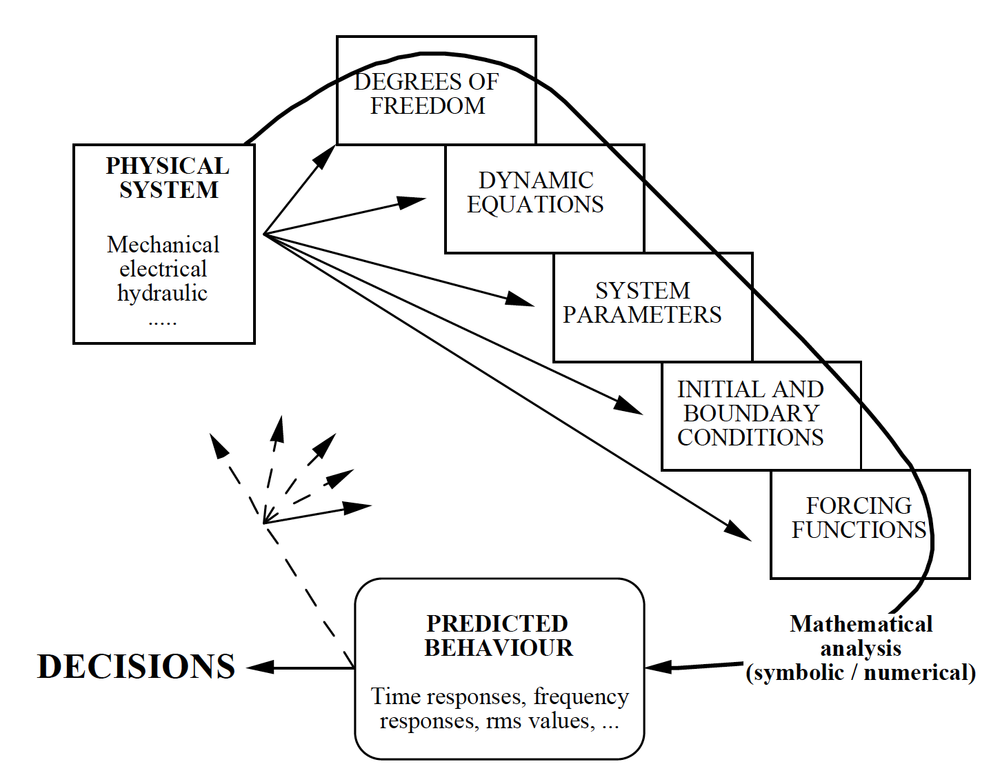
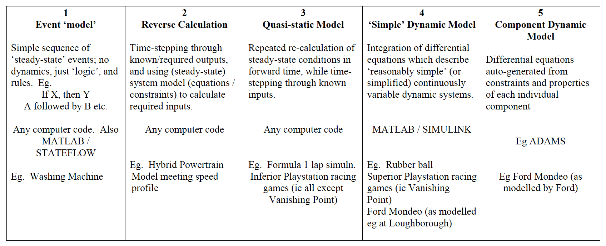

# TTC066 Vehicle Dynamics and Simulation Notes

## Introduction

Engineering systems are usually modelled as part of a wider process of decision making.  Naturally, there are advantages in using models to ‘replicate’ physical behaviour -  for example parametric studies can be undertaken quickly and efficiently (in many cases) for trade-off analysis and optimisation.  However there are some subtle factors which should be kept in mind;

* “All models are wrong - but some are useful” (George Box) - that is, all models have their limitations - so never accept results without question
* Modelling almost always helps to develop understanding of a system
* The engineer/ modeller decides the valid domain of a model - by careful consideration or by default
* Numerical procedures have their limitations

## What is a differential equation and how does it relate to the real world?

We know about ‘differentiation’, and ‘integration’ in equations, for example;

$$
y = 3x^2 + 2
$$

$$
\frac{dy}{dx} = 6x
$$

$$
\int{y} = x^3 + 2x + c
$$

These are what we call analytical functions – where the answer is itself an equation and you can plug in numerical values for $x$ to give the required value for $y$, $\frac{dy}{dx}$ or $\int{y}$. The dynamic behaviour of systems is related using differentiation and integration (with respect to time), but the relationships are more like:

$$
M\frac{dv}{dt} = F - \frac{1}{2}\rho AC_{d}V^2
$$

Such that the derivative of the value dependent on the value itself. This equation shows a good example – a simplified model of the longitudinal dynamics of a car. $F$ is the drive force at the wheels, and $v$ is the forward velocity. The second term on the right hand side represents aerodynamic losses, and $M$, $\rho$, $A$ and $C_d$ are (constant) parameters.

In dynamic simulation, because the dependent variable is (nearly) always time, $t$, we use the notation $\dot{V}$ in place of $\frac{dV}{dt}$. So, in straight line vehicle acceleration, if position is $x$, velocity is $V$ and acceleration is $a$, we have:

$$
    V=\dot{x}
$$

$$
    a=\dot{V}=\ddot{x}
$$

Although we can solve the equation analytically, the solution will only be valid for a fixed (input) force $F$, or if $F$ can be replaced by some other (analytical) function of time. And it will give us just one ‘result’.

In simulation, we want to generate time histories – a trace of how the variable changes over time. To do this, and allow for maximum flexibility in specifying $F$, we use numerical integration, rather than analytical solution.

Important notation:
*Variable* : Something which changes over time, and which we could find a time history for.
*Parameter* : A constant, which is needed within the model, but which we might vary for separate simulation runs (eg suspension spring stiffness – we might vary this to do a design study).

## Generation of differential equations (simple examples)

Dynamic models are described in terms of a series of differential equations which can always be reduced to a set of first order differential equations. Two examples which we will refer to in these notes are the simplified single degree-of-freedom suspension model, and the bouncing ball model (shown below). Note that the ‘simplification’ stage of model design has already
been completed for these cases – the former being reduced to a rigid mass suspended over a point which is fixed on the ‘road’ by a simple spring and viscous damper (and which moves only vertically); the latter switches between contact and non-contact conditions.