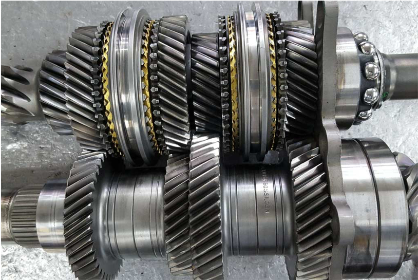
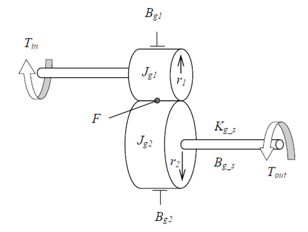

<!-- Scoped style -->

# Vehicle Dynamics and Simulation

## Drivetrain Modelling

---

## Transmission

* Conceptually very simple however speed synchronisation of input and output shafts and inertia ‘switching’ i.e. 1dof -> 2dof -> 1dof adds complexity.
* Lash non-linearity excites high frequency dynamics that result in very stiff system – can be dealt with by increasing damping.
* Parameterisation can also be troublesome;
  * Different frictions and inertias depending on gear ratio.

---
<!-- Scoped style -->

## Transmission

$$
J_1\ddot\theta_1=T_{in}-B_{g1}\dot\theta_{g1}-F_{r1}
$$

$$
J_2\ddot\theta_2=Fr_2-B_{g2}\dot\theta_{g2}-T_{out}
$$

Perfect gear means that an algebraic constraint exists;

$$
r_1\theta_1=r_2\theta_2
$$

$$
J_{g1}\frac{r_2}{r_1}\ddot\theta_{g2}=T_{in}-B_{g1}\frac{r_2}{r_1}\dot{\theta}_{g2}-Fr_1
$$

$$
J_{g1}\frac{r_2}{r_1}^2\ddot\theta_{g2}=T_{in}\frac{r_2}{r_1}-B_{g1}\left(\frac{r_2}{r_1}\right)^2\dot{\theta}_{g2}-Fr_2
$$

And the complete system described (which can also be arranged for $\theta_{g1}$;

$$
\ddot\theta_{g2}=\frac{{T_{in}\frac{r_2}{r_1}-B_{g1}\frac{r_2}{r_1}^2}\dot{\theta}_{g2}-B_{g2}\dot{\theta}_{g2}-T_{out}}{J_{g1}\frac{r_2}{r_1}^2+J_{g2}}
$$

---

## Slide 3

---

## Slide Test

this is the ways that the slidss are formatted and that the textadsfsdf asdfadsf asdfa dsfasdfas dfasdf adsfasdf dsfasdfasd fasdfasdfads f

___
