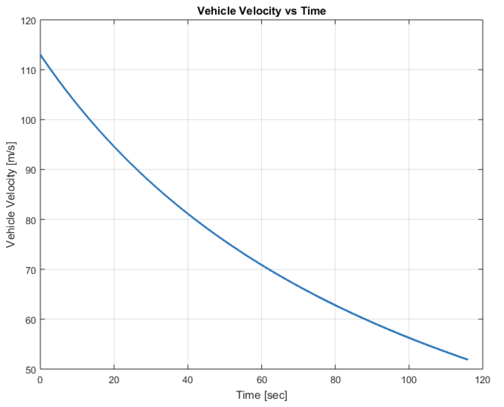
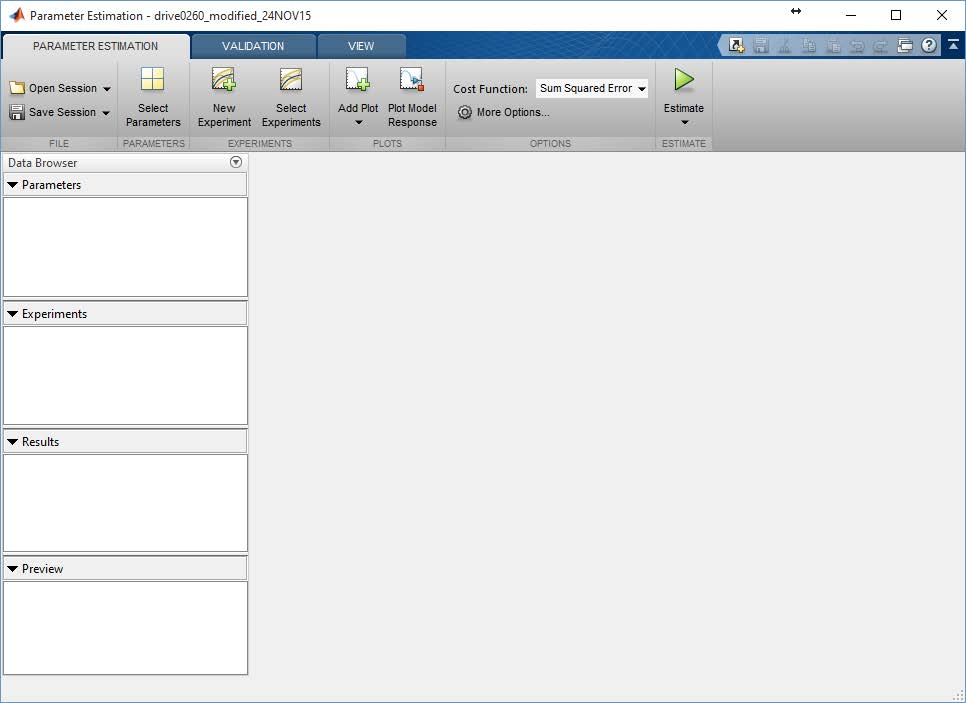
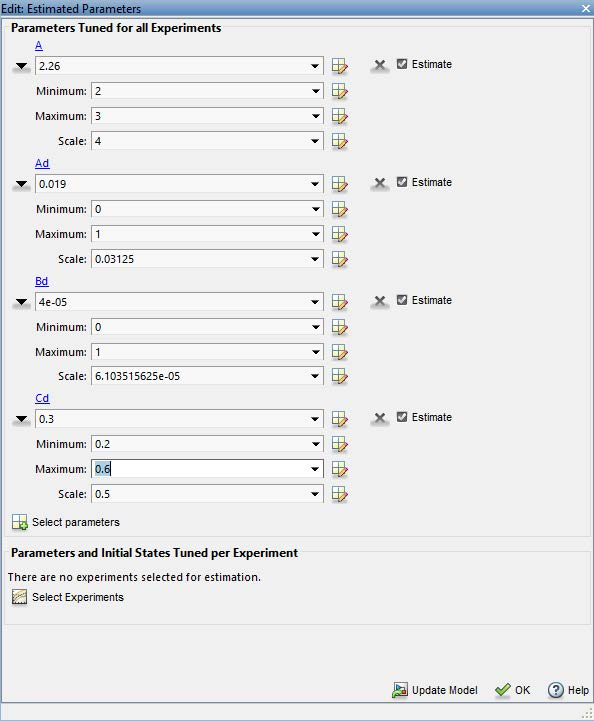
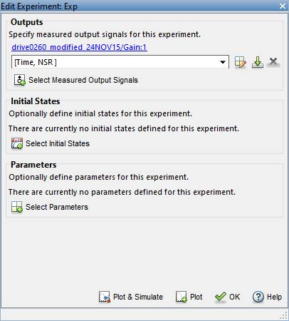
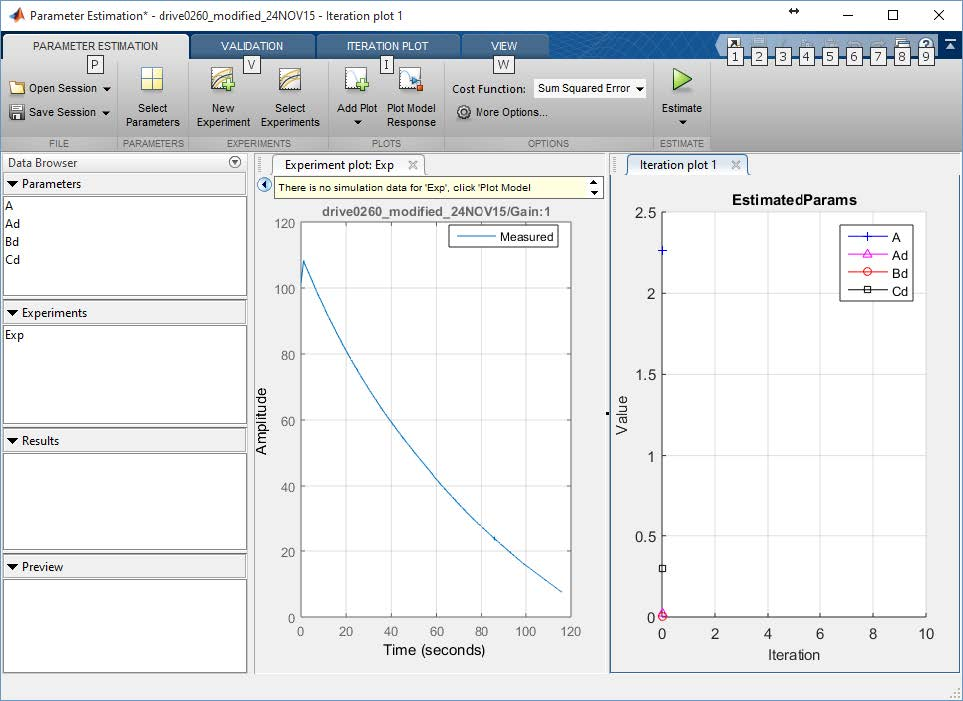
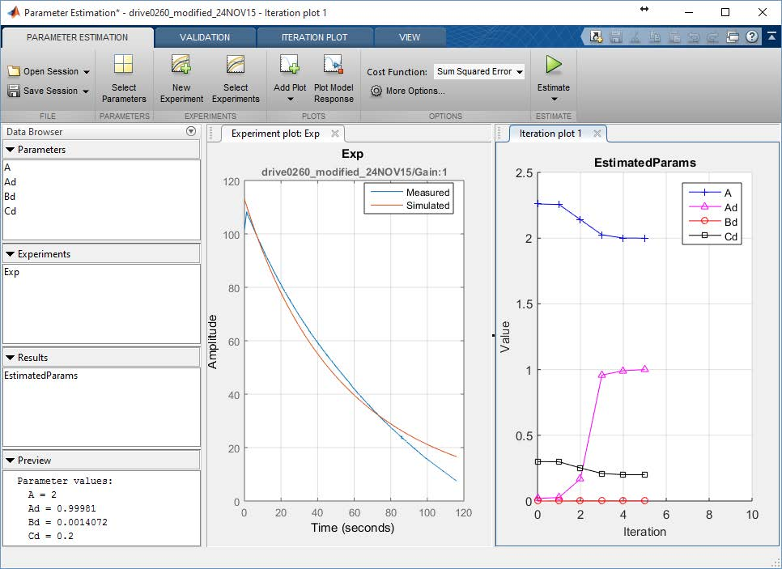

# Vehicle Dynamics and Simulation

## Model Tuning Laboratory

This lab is designed to familiarise you with the model tuning capabilities within Simulink. These will be used on the drivetrain model that you have been developing. The parameters of the model will be tuned in such a way that the model most accurately represents some sample experimental data.

This laboratory is only an introduction to model tuning and suggests some of the ways in which you might wish to approach this. Please note that this does not represent all possible ways in which the model can be tuned. In terms of the coursework the methods outlined for model tuning represent the absolute minimum required.

### 1. Getting Started

Open your drivetrain model, making sure that the parameter files are available on the Matlab path. Simulate the model for 120 seconds or so with some suitable initial conditions, make sure that no errors are generated and observe the outputs of each of the subsystems to make sure that they are sensible.

#### 1.1 Coastdown Tuning

In the model parameter file set the vehicle initial velocity to 111 m/s. Ensure that the initial conditions of all the other subsystems are suitably set. Next set the clutch to be fully disengaged throughout the duration of the simulation, this can be done by setting the clu_engage parameter to some high value.

Run the model and observe the vehicle velocity, which should look similar to the plot below;

{ width=80% }

Select Analysis>>Parameter Estimation from the menu bar and the Parameter Estimation window will open.

Press Select Parameters and then choose the parameters within the model that affect the vehicle coastdown performance. For a start select the front area, $A$, tyre rolling resistance coefficients, $A_d$ and $B_d$ and the coefficient of drag $C_d$.

Select the arrow next to the parameters and enter sensible (physically rea  listic) minimums and maximums for each of the parameters. Since the parameters are physical in nature they will always be positive.

Select OK. In the parameter file comment out each of the parameters you have selected.

Load the experimental data Coast-data.mat, available on LEARN. Next select New Experiment>>Select Measured Output Signals. In your model then select the vehicle velocity, note that this will need to be scaled to km/hr. Once you have done this enter the variable names of the measured data [Time, NSR] (hint: an average of NSR and OSR would be more accurate) which is a time vector and Near Side Rear wheel velocity (driven wheels). Then select OK.

{ width=60% }

Next click on Add Plot and add a plot of the experimental data and the parameter trajectories. To view these side by side select the View tab and then Left/Right.

Next click on estimate which starts the parameter estimation using the default optimiser settings.

By default the optimiser searches for parameter values that minimise the sum of the squared estimation error i.e. the sum of the squared error between the simulation and experimental results. After a number of iterations (up to 100 by default) the optimisation ends as the error converges to some minimum value (note that this may be a local optimum which depends on the model initial conditions). The model response is plotted alongside the experimental data.

Following the optimisation the parameter values can be seen by double clicking anywhere within the Parameters box. If your judge these as acceptable i.e. physically realistic then enter these into the Parameter file. If not then adjust the constraints and/or add in more parameters as required. Two to three iterations are suggested. Think about any modifications that you could make to your model to make it more representative.

{ width=80% }

#### 1.2 Time to Speed

Now follow a similar process for the time to speed data. To do this you will have to think carefully about how you implement the simulation and/or pre-process the comparative experimental data provided in the Accel-data.mat file.

Open the Accel-data file available on LEARN. Look at each of the parameters noting which you could use as inputs to your model and which you could use as outputs. Think about how they relate to your model (look at the units).

Use From Workspace blocks to feed the experimental data to the model, at the very least you will have to do this for the inputs. For a first attempt at Time to Speed tuning add From Workspace blocks for the throttle pedal, clutch and gear number. For the throttle and clutch pedals note the sign convention and range of travel and how these may differ from the model compared to the experimental results.

Set up a parameter optimisation initially for vehicle speed, try optimising some of the parameters that are of consequence to the Time to Speed evaluation (discussed in the lab. Again attempt two to three iterations, checking the optimiser outputs for physical sense. Again think of any small changes that you could make to the model to improve the results based on your observations.

For all of the above optimisations produce plots to show the improvements to the model output as a consequence of the parameter tuning. Show the parameter trajectories through the optimisation process and comment on the number of iterations attempted by the optimiser to achieve a solution.
